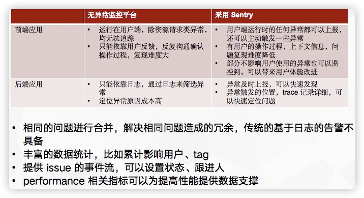

# [Sentry](https://sentry.io/welcome/)

#### 基本介绍

在前端错误报告方面, Sentry 已经成了许多团队的默认选项。 Sentry 提供了一些便利的功能, 比如错误分组, 以及使用适当的参数定义错误过滤规则, 可以极大地帮助处理来自终端用户设备的大量错误。通过将 Sentry 集成到持续交付流水线中,你可以上传源码映射文件, 从而更高效地调试错误, 并能很容易追踪到是在哪个版本的软件中产生了这些错误。我们很欣赏尽管 Sentry是个 SaaS 产品, 但它的源代码是公开的, 这样就可以免费用于一些较小的用例和自托管中。

* [Sentry on Radar](https://www.thoughtworks.com/radar/tools/sentry), 2018 年 5 月进入评估阶段，2020 年 10 月进入试验阶段，2021 年 4 月进入采纳阶段。
* [Self-Hosted Sentry](https://develop.sentry.dev/self-hosted/), 私有化部署，docker compose 即可。
* [sentry 的作用和使用场景?](https://www.zhihu.com/question/23922181)
  > 我们主要用Sentry来做下面这几件事情：
  > 
  >   1、浏览器端的javascript的异常的采集和记录；
  > 
  >   2、服务端的java的log4j的异常日志的采集；
  > 
  >   Sentry是基于python+redis+postgresql，跟我们现有的架构不太一致，为了减少部署和维护的麻烦，我们做了一些改造，将服务端用java重写了，数据库也改回用mysql。
  > 
  >   回答时间：20160815
* [神策数据王朋：如何搭建一套高可用的前端异常监控系统？](https://zhuanlan.zhihu.com/p/381930994)
* [基于Sentry搭建前端异常监控系统](https://segmentfault.com/a/1190000040237095)
  
#### 前后端使用比较

来源: [错误上报和应用性能监控平台 Sentry](https://segmentfault.com/a/1190000039131388)

#### 个人主观使用感受

* 聚焦在错误报告，目前主要的使用领域在前端。
* 如果后端系统使用，主动控制错误报告的 qps 较低，对生产影响较小。但性能监控对生产环境影响较大，而且功能上与 Grafana 有一定的重合，所以不推荐后端使用性能监控。
* 所有权规则可以比较方便的对问题进行路由。
* 在同类产品中较为突出。

#### Sentry 自身集群部署性能

TODO

#### Sentry 在单点的测试实践

TODO

#### 个人思考

Sentry 的成功在一定程度上说明了实时的错误追踪对于辅助解决生产环境的问题效果良好。如果不使用 Sentry 而仅是将错误或者异常包装成 http 请求的参数最终汇聚在一台`链路服务器`上是否满足基本要求？在 [凤凰架构: 事件日志](https://icyfenix.cn/distribution/observability/logging.html) 中提到 `避免打印追踪诊断信息: 日志中不要打印方法输入参数、输出结果、方法执行时长之类的调试信息。这个观点是反直觉的，不少公司甚至会将其作为最佳实践来提倡，但是笔者仍坚持将其归入反模式中。日志的职责是记录事件，追踪诊断应由追踪系统去处理，哪怕贵公司完全没有开发追踪诊断方面功能的打算，笔者也建议使用BTrace或者Arthas这类“On-The-Fly”的工具来解决。之所以将其归为反模式，是因为上面说的敏感信息、慢操作等的主要源头就是这些原本想用于调试的日志。` 这样一种观点，即记录事件的日志和追踪诊断的上下文应该区隔开。而在 [凤凰架构: 链路追踪](https://icyfenix.cn/distribution/observability/tracing.html) 介绍的第一种链路追踪收集数据的方法就是 **基于日志的追踪（Log-Based Tracing）**, 可以把收集日志内容并抽取归并链路信息视为第一阶段。

从抽象意义上，如果将错误视为日志记录的一部分，则错误与正确数据的日志重要性平等，错误只不过是一种需要特殊关心的日志。这种抽象很难解释开发人员的维护工作：假设系统中 99% 的数据和流程是正确的，则 99% 的正确数据的上下文和内容信息总是被忽略，这些存储被浪费了，仅作为聚合数据中的一个数字存在；而 1% 的错误数据的上下文和内容信息可用，这些数据需要排查原因，单次发生的错误或者是可重现的错误总是容易解决，而周期性不固定的错误从日志这种载体中进行汇总跟踪显得比较吃力。从这些特征看来，将错误视为日志记录的一部分这种抽象似乎不太拟合开发人员的使用方式。

换一种抽象方式，我们将错误视为链路追踪的一部分。日志系统在需要触发 warning, error 级别时将数据以异步或者高效的方式发送到`链路服务器`服务器上，日志不再方法输入参数、输出结果、方法执行时长之类的调试信息。这种模式区别对待程序错误与普通的日志记录，可以降低日志的存储成本，但是也需要投入`链路服务器`这样的计算资源，巨量的服务错误收集意味着相对应的巨量`链路服务器`服务，这里需要一种成本的权衡：例如只对错误数据进行追踪，或者是除了错误数据对整个系统的日志追踪但是维持一个较低的采样率。日志用于回答开发人员`代码执行到了哪里?`这个问题，而如果程序发生错误，开发人员可以在异步收集的链路追踪系统里拿到错误发生时的较完整上下文，较方便地汇总计算多个分布式系统的错误，定义统计数据之后的报警。对于需要统计学参与的错误，这种方式可以更快的定位影响范围，例如阿里的鹰眼中就提到取错误 TopN 的分布：`虽然 EagleEye 的调用链接可以快速定位这些问题，但是调用链接是从单个请求的角度来看的。定位 IP 后，可能需要分析更多数据，然后才能做出适当的决策。针对这些问题，EagleEye提供了错误TopN分布、系统热图等功能，让业务端开发者能够快速定位问题。独立故障通常对整体指标几乎没有影响，并且很难通过应用程序级监控指标进行定位。EagleEye 计算单个机器上的错误，汇总机器并找到排名前 10 的机器。一旦发生独立故障，EagleEye 可以定位特定 IP，并根据该 IP 下的错误数量做出适当的决策。这减少了开发人员解决问题的时间。系统热图可以清楚地显示压力测试和大型促销活动期间系统的健康状况。一方面，我们可以清楚地看到是否有异常值的机器。另一方面，我们可以验证流量是否到达正确的地方。`.

综上所述，将错误发送到服务器统一收集处理是一种有效的错误聚合处理手段。实际操作时需要考虑错误发送的内容规范、错误发送的成本、收集服务器的性能等多种因素。迁移阶段如果成本足够，可以错误日志和错误收集并行运行一段时间，然后逐步缩小日志中的调试信息比例。

#### 延伸阅读

* [Dapper，大规模分布式系统的跟踪系统](http://bigbully.github.io/Dapper-translation/)
* [Dapper, a Large-Scale Distributed Systems Tracing Infrastructure](http://static.googleusercontent.com/media/research.google.com/en//pubs/archive/36356.pdf)
* [分布式调用跟踪](https://github.com/HiAwesome/micro_services_arch/blob/master/distributed_trace.md)
* [从谷歌Dapper到阿里EagleEye看分布式链路追踪](https://zhuanlan.zhihu.com/p/163806366)
* [Spring Cloud Sleuth](https://github.com/spring-cloud/spring-cloud-sleuth)
* [Meiturn Cat](https://github.com/dianping/cat)
* [Apache skywalking](https://github.com/apache/skywalking)
* [凤凰架构: 可观测性](https://icyfenix.cn/distribution/observability/)
  * [凤凰架构: 事件日志](https://icyfenix.cn/distribution/observability/logging.html)
  * [凤凰架构: 链路追踪](https://icyfenix.cn/distribution/observability/tracing.html)
  * [凤凰架构: 聚合度量](https://icyfenix.cn/distribution/observability/metrics.html)
* [阿里巴巴 EagleEye：通过链路监控确保业务连续性](https://www.alibabacloud.com/blog/alibaba-eagleeye-ensuring-business-continuity-through-link-monitoring_594157)
