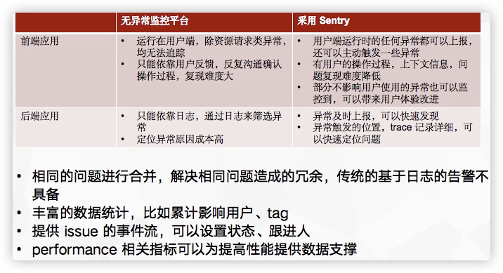

# Technology Radar

##  24 期

### 工具

#### [Sentry](https://sentry.io/welcome/)

在前端错误报告方面, Sentry 已经成了许多团队的默认选项。 Sentry 提供了一些便利的功能, 比如错误分组, 以及使用适当的参数定义错误过滤规则, 可以极大地帮助处理来自终端用户设备的大量错误。通过将 Sentry 集成到持续交付流水线中,你可以上传源码映射文件, 从而更高效地调试错误, 并能很容易追踪到是在哪个版本的软件中产生了这些错误。我们很欣赏尽管 Sentry是个 SaaS 产品, 但它的源代码是公开的, 这样就可以免费用于一些较小的用例和自托管中。

* [Sentry on Radar](https://www.thoughtworks.com/radar/tools/sentry), 2018 年 5 月进入评估阶段，2020 年 10 月进入试验阶段，2021 年 4 月进入采纳阶段。
* [Self-Hosted Sentry](https://develop.sentry.dev/self-hosted/), 私有化部署，docker compose 即可。
* [sentry 的作用和使用场景?](https://www.zhihu.com/question/23922181)
  > 我们主要用Sentry来做下面这几件事情：
  > 
  >   1、浏览器端的javascript的异常的采集和记录；
  > 
  >   2、服务端的java的log4j的异常日志的采集；
  > 
  >   Sentry是基于python+redis+postgresql，跟我们现有的架构不太一致，为了减少部署和维护的麻烦，我们做了一些改造，将服务端用java重写了，数据库也改回用mysql。
  > 
  >   回答时间：20160815
* [神策数据王朋：如何搭建一套高可用的前端异常监控系统？](https://zhuanlan.zhihu.com/p/381930994)
* [基于Sentry搭建前端异常监控系统](https://segmentfault.com/a/1190000040237095)
  
#### 前后端使用比较

来源: [错误上报和应用性能监控平台 Sentry](https://segmentfault.com/a/1190000039131388)

#### 个人主观使用感受

* 聚焦在错误报告，目前主要的使用领域在前端。
* 如果后端系统使用，主动控制错误报告的 qps 较低，对生产影响较小。但性能监控对生产环境影响较大，而且功能上与 Grafana 有一定的重合，所以不推荐后端使用性能监控。
* 所有权规则可以比较方便的对问题进行路由。
* 在同类产品中较为突出。
