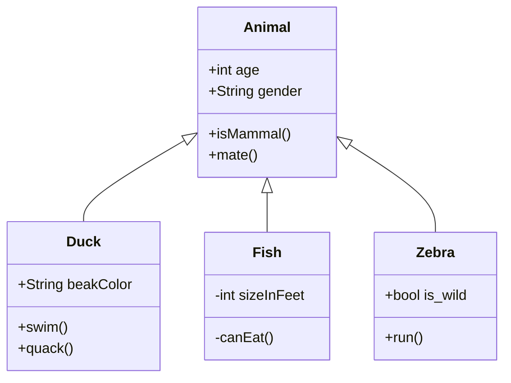

[[_TOC_]]

# 测试 Gitlab Markdown 语法

* [官方文档](https://docs.gitlab.com/ee/user/markdown.html#gitlab-flavored-markdown-gfm)
* [官方热更新的文档](https://gitlab.com/gitlab-org/gitlab/blob/master/doc/user/markdown.md)

### 颜色测试
- `#F00`
- `#F00A`
- `#FF0000`
- `#FF0000AA`
- `RGB(0,255,0)`
- `RGB(0%,100%,0%)`
- `RGBA(0,255,0,0.3)`
- `HSL(540,70%,50%)`
- `HSLA(540,70%,50%,0.3)`

### 图表和流程图

#### Mermaid

1. 流程图


2. 类图



### 表情

1. 官方 Emoji 样例

Sometimes you want to :monkey: around a bit and add some :star2: to your :speech_balloon:. Well we have a gift for you:

:zap: You can use emoji anywhere GFM is supported. :v:

You can use it to point out a :bug: or warn about :speak_no_evil: patches. And if someone improves your really :snail: code, send them some :birthday:. People will :heart: you for that.

If you're new to this, don't be :fearful:. You can easily join the emoji :family:. All you need to do is to look up one of the supported codes.

Consult the [Emoji Cheat Sheet](https://www.emojicopy.com) for a list of all supported emoji codes. :thumbsup:

2. 直接打出来的表情

有时您想稍微🐒一下，然后在您的💬上加上一些🌟。好吧，我们有礼物送给您：

⚡您可以在支持GFM的任何地方使用表情符号。✌️

您可以使用它指出🐛或警告🙊补丁。如果有人改进了您的🐌代码，请向他们发送一些🎂。人们会为此而❤️你。

如果您是新手，请不要😨。您可以轻松加入表情符号👪。您需要做的只是查找受支持的代码之一。

有关[所有受支持的表情符号代码的列表](https://www.emojicopy.com)，请查阅表情符号备忘单。👍

3. 总结

第一种方式是使用官方 emoji 支持列表的格式，第二种方式是使用 UTF-8 直接打出来的表情，后者更自然也更有移植性。

### 内连差异

用来显示文件改动差异效果较好。

- {+ 增加 1 +}
- [+ 增加 2 +]
- {- 删除 3 -}
- [- 删除 4 -]

- {+ 正常字符 +}
- {+ 字符中有 \`反引号\` 的 +}

### 数学

显示复杂的数字计算。

正常的行显示: $`a^2+b^2=c^2`$.

单独的行显示:

```math
a^2+b^2=c^2
```

### 任务清单

- [x] 完成的任务
- [ ] 未完成的任务
  - [ ] 子任务 1
  - [x] 子任务 2
  - [ ] 子任务 3

1. [x] 完成的任务
1. [ ] 未完成的任务
   1. [ ] 子任务 1
   1. [x] 子任务 2

### 多行块引用

>>>
asdf

kkkk

kkkk
>>>

### 图片


### 视频


### 上标和下标

水的公式为 H<sub>2</sub>O, 而相对论的公式为 E = mc<sup>2</sup>.


